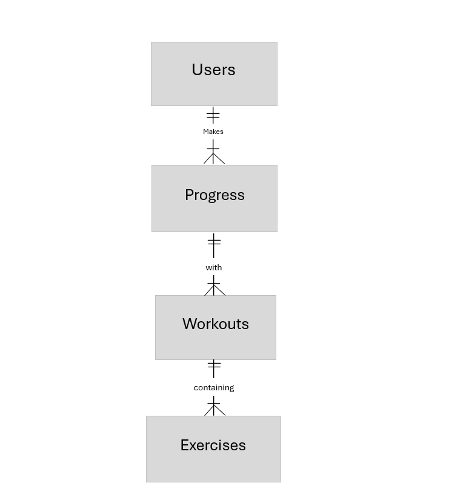

# Design Document

By Blu Dennis

Video overview: [URL here]

## Scope

In this section, the scope of the database is defined:

* Purpose of the Database: The database is designed to manage and track workout information, including user progress, exercises, and workouts that the user would like to participate in.

* Included in Scope:
    - Users: Individuals participating in workouts.
    - Workouts: Sessions with a specific name, date, and duration.
    - Exercises: Various exercises categorized by name, category, and difficulty.
    - Progress: Tracking the calories burned during each workout.
    - Workout Exercises: Associating multiple exercises with a single workout.

* Outside of Scope:
    - Detailed user information such as age and gender is limited to basic identifiers.
    - Additional metrics like heart rate or performance analytics are not included.

## Functional Requirements

This database will support:

* User Interactions:
    - CRUD operations for users, workouts, exercises, and progress.
    - Associate multiple exercises with a workout.

* Beyond the Scope:
    - Advanced analytics or predictive modeling based on user data is not supported.
    - User-specific detailed analytics (e.g., age trends) are excluded.

## Representation

Entities are captured in SQLite tables with schema.sql.

## Entities

Defining the entities and their attributes:

### Users
the 'users' table includes:

* 'user_id', which specifies the unique ID for the user as an INTEGER. This column has * the PRIMARY KEY constraint applied.

* 'username', which specifies the users' name as TEXT.

* 'age', which indicates the age of the user as INTEGER.

* 'gender', which indicates the users' gender via TEXT and can only be 'Male' or 'Female'.

### Workouts
The 'workouts' table includes the following:

* 'workout_id' is the unique ID for the specific workout as INTEGER and is also the PRIMARY KEY of the table.

* 'name', which specifies the name of the workout and is represented as TEXT.

* 'date', which indicates the date on which the workout was completed, represented via the DATE datatype.

* 'duration', which is the total time taken to complete the workout as TIME.

### Exercises
The 'exercises' table contains:

* 'exercise_id', the unique ID of the exercise as INTEGER and has the PRIMARY KEY constraint applied to it.

* 'name', which indicates the name of the exercise to be performed, as TEXT.

* 'category' describes the category that the exercise falls under and is represented as TEXT. It is restricted to be one of the following categories:
    - 'triceps'
    - 'biceps'
    - 'back'
    - 'legs'
    - 'chest'
    - 'forearms'
    - 'shoulders'

* 'difficulty' shows how difficult it is to perform the exercise and is shown on a scale from 1 to 5 as INTEGER.

*  'workout_id' references the workout session that the exercise is related to 

### Progress
The 'progress' table includes the following:

* 'progress_id' is the PRIMARY KEY of the table and represents the unique ID of the progress made by a user in the INTEGER format.

* 'user_id', which indicates the unique ID of the user (INTEGER) from 'users' and is a FOREIGN KEY within the 'progress' table.

* 'workout_id' is also a FOREIGN KEY, but from the 'workouts' table and is a FOREIGN KEY inside of the progress table.

* 'calories_burned' is of type INTEGER, and it indicates the total amount of calories burned during the workout session.

## Relationships

https://github.com/code50/107883218/blob/main/project/diagram.png

As detailed by the diagram:

* A user is able to make no (0) to many progress If no progress is made, they still be allowed to make progress which can be done by completing one or more workouts. Progress can be made by one user and one user alone. It is assumed that the user will complete their workouts individually as opposed to in a group.

* Each singular progress entry corresponds to a specific workout performed by an individual user, which could include one or more completed workouts at a time.

* A single workout is associated with one or more workout exercises. At the same time, a workout exercise is associated with one and only one users' progress.

## Optimizations

* Indexes were created on the most relevant columns ('username', 'workout_id', 'exercise_id', 'progress_id') for faster retrieval of data for the user.

* The design includes several views to simplify data retrieval:
- specific_user: A view to find a specific user's progress based on their username.
- workout_details: A view to display workout details along with the exercises performed.
- user_total_calories: A view that summarizes the total calories burned by each user

## Limitations

* The current schema assumes individual workout sessions, which means that collaborative workouts might require adjustments so that many-to-many relationships between users and workouts can occur.

* Detailed user-specific analytics beyond basic identifiers are not within the scope. This limmits the ability to perform in-depth analysis on user behavior, trends or personalized fitness recommendations.

* Error handling: The current implementation does not include robust error handling for scenarios such as attempting to insert progress for non-existent users or workouts, which could lead to foreign key constraint violations.

